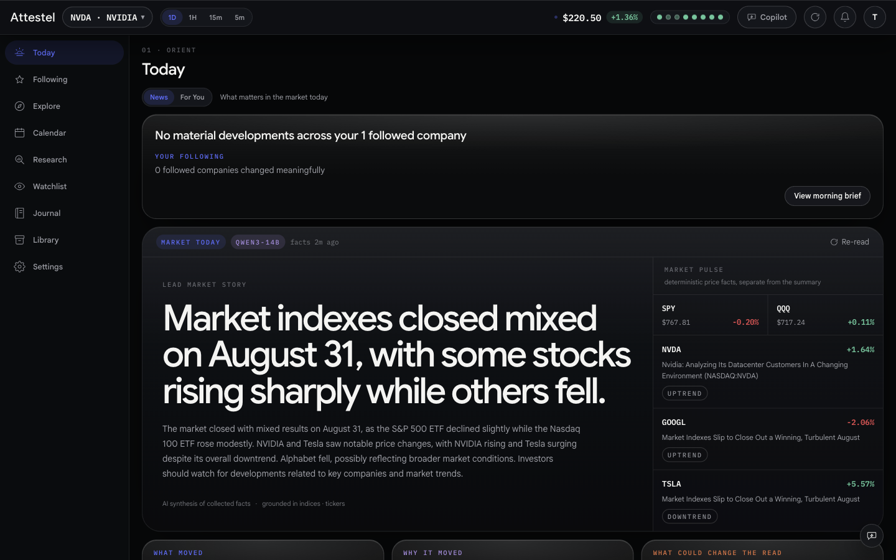
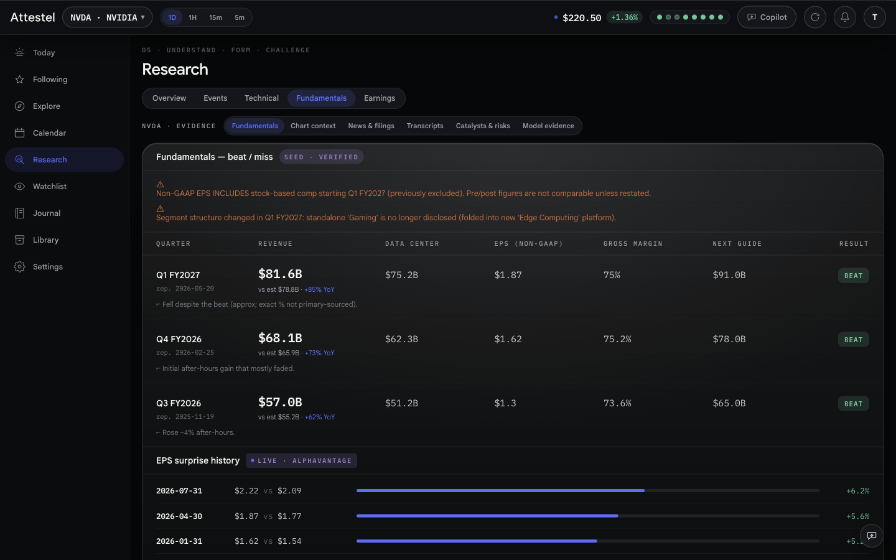
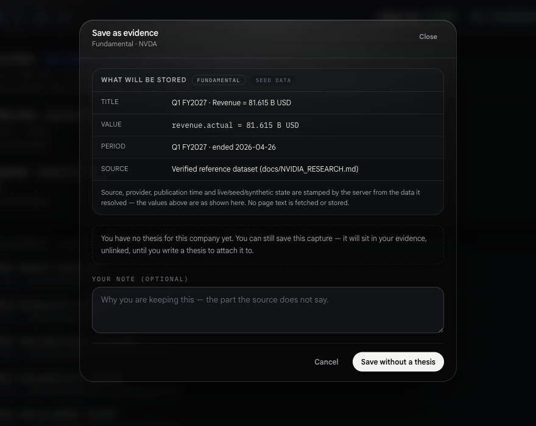
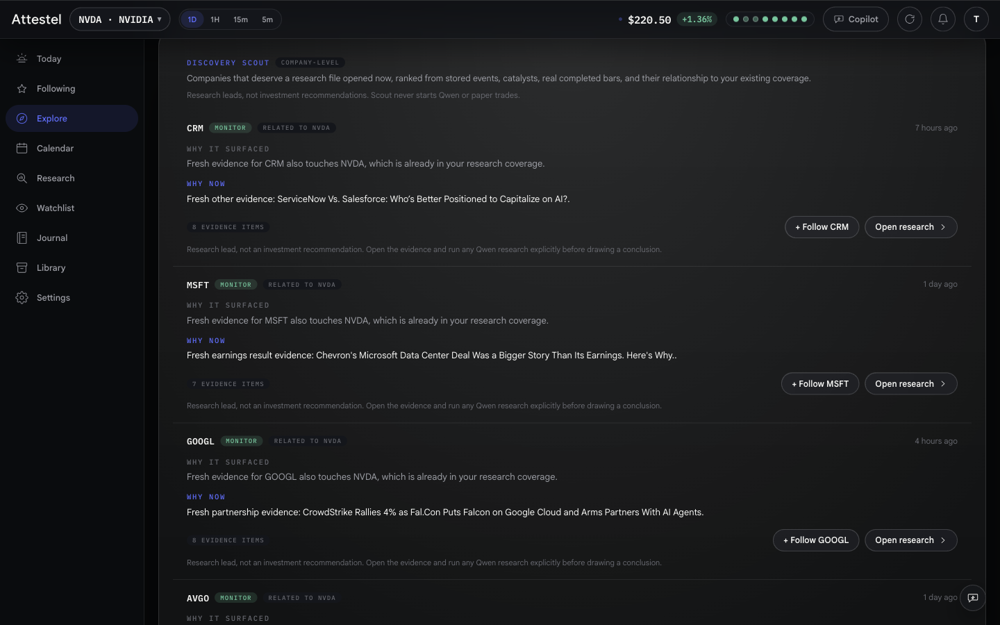

# Attestel

[](LICENSE) [](#status-and-honest-limits) [](CONTRIBUTING.md)

**An investment research OS you run yourself.** Your data, your machine, your model.

Attestel is a self-hosted research workspace built around one object: the **investment thesis** — a
falsifiable claim you own, with the assumptions it rests on, the evidence attached to it, the lenses
that argue against it, the conditions that would invalidate it, and a permanent record of what you
decided and what actually happened. Charts, indicators, model reads and earnings data are all still
here; they are *evidence attached to a claim* rather than the product itself.

- **Runs on your own hardware.** One `docker compose up`. Postgres and the app, nothing phoning home.
- **Your own model.** Point it at a local Qwen3 (Ollama, or any OpenAI-compatible server such as
  vLLM / SGLang / LM Studio). No model vendor account, no per-token bill.
- **$0 data budget.** The default path uses free, keyless providers — SEC EDGAR, yfinance, Google
  News RSS — plus the official BLS / BEA / Federal Reserve release calendars. Paid API keys are all
  optional and only widen coverage.
- **Provenance on every number.** Each figure carries where it came from and when it was fetched.
  Synthetic fallback data is labelled as synthetic, in the UI, always.
- **Analysis only.** It never places an order, moves money, or integrates a broker.

> **Beta.** This is honest-beta software: it runs, it is tested, and it is not finished. Some
> subsystems are deliberately inert until they have earned their way on — see
> [Status and honest limits](#status-and-honest-limits). Expect rough edges, breaking changes
> between commits, and documentation that is ahead of the polish.



---

## Why

Serious equity research takes a person days to weeks per company: gathering filings, checking
numbers, writing the thesis, tracking what changes, and being honest afterwards about what you got
wrong. Attestel automates the gathering and the bookkeeping so the human can spend their time on
judgment.

We built it self-hosted with a local model because research this personal — your theses, your
decisions, your mistakes — shouldn't live on someone else's servers, and because a research habit
shouldn't come with a per-token bill. And it never tells you to buy or sell anything: that
discipline is the product.

---

## What it is

Nine destinations, each serving a stage of the research loop:

| Destination | Stage | What it is |
|---|---|---|
| **Today** | Orient | what changed since you last looked, what needs review, what is coming |
| **Following** | Monitor | canonical events affecting companies you follow, plus portfolio intelligence |
| **Explore** | Orient | market-wide discovery with a reason and possible read-through on every item |
| **Calendar** | Orient · Monitor | dated catalysts and your review commitments |
| **Research** | Understand · Form · Challenge | one company research file: Overview · Events · Technical · Fundamentals · Earnings, plus thesis, evidence and challenge workspaces |
| **Watchlist** | Monitor | companies and the monitoring rules attached to your theses |
| **Journal** | Decide · Review | Decisions · Outcomes · Trades · Experiments |
| **Library** | Understand · Challenge | retrieval across saved evidence, reviews, transcripts and lenses |
| **Settings** | — | preferences, help and feedback |

Multi-ticker (NVDA + GOOGL + TSLA by default, configurable via `TICKERS`) and multi-timeframe
(1D / 1H / 15m / 5m). NVDA ships with a verified reference seed
([docs/NVIDIA_RESEARCH.md](docs/NVIDIA_RESEARCH.md)) so the app is useful before you configure
anything at all.

### The discipline

These are design invariants, not preferences. They are enforced in code and in tests:

1. **No buy/sell verdicts from the language model.** The model read, regime and confluence carry no
   prescriptive language — a banned-phrase list rejects the response if they do.
2. **The model never invents a number.** Key levels and moving averages are computed
   deterministically in the `analysis` service and handed to the model to *quote*; the server
   re-imposes them after the model replies so they cannot drift.
3. **One exception, heavily gated.** A directional Buy/Hold/Sell *suggestion* exists, but only as
   the output of a quant model validated by a walk-forward backtest, shown only with its track
   record (hit rate, Sharpe, expectancy, drawdown) and confidence. No passing backtest → no signal.
4. **The model stays out of every polling loop.** No timer, cron or scheduler tick may cause a model
   call. Background enrichment is a single-pass, queue-draining worker, off by default, started only
   by an explicit operator command.
5. **It suggests and simulates; you execute.** The `paper` service simulates trades to validate the
   signal out-of-sample. There is no order execution, no broker integration and no money movement
   anywhere.

---

## Architecture

Independently-deployable services aggregated by a standard-library-only Go gateway:

```
React (web, :5173)  ──►  Go gateway (:8080)  ──►  Python analysis (:8001)  price+indicators+regime
                                             └─►  Python llm      (:8002)  local model read (or stub)
                          gateway also serves verified seed fundamentals / roadmap / news

                    └─►  Go alerts (:8095)   ──►  analysis + gateway signals   scheduled rule checks
                          descriptive notifications (in-app feed / webhook / email); no trading
                    └─►  Go journal (:8096)  ──►  analysis /quote + gateway read   manual trade record
                          P&L / stats + read-at-entry snapshot; no broker, no orders, not advice

Go gateway  ──►  Python prediction (:8003)  ──►  analysis /features   LightGBM + walk-forward backtest
                  backtest-gated Buy/Hold/Sell suggestion + confidence; no signal without a passing test

Go paper (:8097)  ──►  prediction + analysis /quote + journal   opens SIMULATED positions from the
                  signal and marks them daily; live paper vs backtest. No execution, no money.

Go auth (:8099)   ──►  local user store (email + PBKDF2) + HMAC session cookie   accounts
                  gateway/journal/alerts verify the SAME cookie with one shared AUTH_SECRET.
                  Guests browse read-only; journal/theses/alerts are per user.

Python analysis (:8001) ──► PostgreSQL `analysis` schema   point-in-time OHLCV replay store
Python events (:8004)   ──► PostgreSQL `public` schema     documents, events, macro and Calendar
Python llm (:8002)      ──► PostgreSQL `llm` schema        reads, committee, transcripts, personas
Python prediction       ──► PostgreSQL `prediction` schema models, verdicts and evaluation evidence
Go journal/alerts/feedback/paper/auth ──► service-owned PostgreSQL schemas for durable user state
                  provider ingestion is explicit and budgeted; browser reads never fetch or call a model.
```

Python does the data and ML work, Go owns the API gateway and the durable user records, React is
thin. The gateway has **zero external Go dependencies** — standard library only.

Full tour: **[docs/APPLICATION_DOCUMENTATION.md](docs/APPLICATION_DOCUMENTATION.md)**.
New to the domain? Start with **[docs/BEGINNER.md](docs/BEGINNER.md)**.

---

## Quickstart

Requires Docker (and Docker Compose v2).

```bash
git clone https://github.com/Attestel/attestel.git
cd attestel
cp .env.example .env      # every key in it is optional; an empty file works
docker compose up --build
```

Then open **http://localhost:5173/app/** (Vite dev) or, for the all-in-one image, the port nginx is
bound to. `.env.example` is heavily commented — read it once, top to bottom; it is the real
configuration reference.

### Add a local model (recommended)

The language-model layer has **no default endpoint**. Unconfigured, it serves an explicit
deterministic stub (`stub:offline`) rather than quietly dialling localhost. Point it at your own
runtime:

```bash
# with Ollama
ollama pull qwen3:14b
# in .env
MODEL_RUNTIME_URL=http://host.docker.internal:11434
MODEL_RUNTIME_MODEL=qwen3:14b
MODEL_RUNTIME_KIND=ollama
```

Any OpenAI-compatible server works the same way with `MODEL_RUNTIME_KIND=openai`. There is
deliberately **no API-key variable** for this runtime: it is meant to be a self-hosted, keyless
endpoint you control.

### Running the services directly (no Docker)

```bash
cd services/analysis && pip install -r requirements.txt && uvicorn app.main:app --port 8001
cd services/llm      && pip install -r requirements.txt && uvicorn app.main:app --port 8002
cd gateway           && go run .          # stdlib only; no `go get` needed
cd web               && npm install && npm run dev
```

Tests are deterministic and need no network and no model:

```bash
cd services/analysis   && ./.venv/bin/python -m pytest -q
cd services/prediction && ./.venv/bin/python -m pytest -q
cd services/llm        && ./.venv/bin/python -m pytest -q
cd services/events     && ./.venv/bin/python -m pytest -q   # needs Python >= 3.10
```

Use each service's own virtualenv — several services need Python ≥ 3.10 and pandas.

---

## Provider configuration

**Nothing here is required.** Every provider fails soft: on a missing key, a rate limit or an error
it returns an error, the caller falls back, and the response is labelled with what actually served
it. The two modes worth understanding:

- **Keyless** (empty `.env`, network available) — yfinance, Google News RSS and SEC EDGAR need no
  key, so you get **real market data with truthful provenance**. This is the demo path.
- **Offline** (no network) — synthetic bars flagged `sourceIsSynthetic: true`, a deterministic model
  stub, and embedded seed data. Synthetic bars are never written to the historical store.

| Key | Unlocks | Free tier | Signup cost |
|---|---|---|---|
| *(none)* | Daily/intraday prices via yfinance, news via Google News RSS, filings via SEC EDGAR | — | keyless |
| `SEC_USER_AGENT` | SEC EDGAR filings — SEC blocks generic agents, so put a real contact email here | — | keyless, but **set it** |
| `EVENTS_CONTACT_UA` | Writing keyless providers into the persistent cross-user event corpus. Ships empty on purpose: an empty `.env` writes zero rows | — | keyless |
| `TWELVEDATA_API_KEY` | Intraday + daily bars, 800 req/day | 800/day | email-only signup, no KYC |
| `ALPHAVANTAGE_API_KEY` | EPS beat/miss history | 25/day | email |
| `MARKETAUX_API_KEY` | News with sentiment scoring | 100/day | email |
| `TIINGO_API_KEY` | Daily-EOD price fallback | ~1k/day | email |
| `FRED_API_KEY` | Macro series from the St. Louis Fed | generous | email |
| `FMP_API_KEY` | Supplementary fundamentals + calendar | limited | email |
| `APCA_API_KEY_ID` / `APCA_API_SECRET_KEY` | Alpaca IEX bars + live quotes | generous | **requires broker KYC** — skip unless you already have an account |
| `BLS_ENABLED` / `BEA_ENABLED` / `FEDERAL_RESERVE_ENABLED` | Official CPI/PPI/payrolls, GDP/PCE and FOMC release calendars | — | keyless (needs `EVENTS_CONTACT_UA`) |

Provider budgets (`EVENTS_BUDGET_*`) cap how many calls each source may make per run, so a free tier
cannot be burned by accident. Everything that reaches the network is off by default.

---

## Screenshots

<table>
  <tr>
    <td width="50%" valign="top">
      
      <sub><b>Research · Fundamentals.</b> Every figure carries its provenance tag, and changes that break year-over-year comparability are stated before the table, not buried under it.</sub>
    </td>
    <td width="50%" valign="top">
      
      <sub><b>Save as evidence.</b> Any number can be attached to a thesis — the server stamps source, provider and live/seed/synthetic state, and your note records why it mattered.</sub>
    </td>
  </tr>
  <tr>
    <td width="50%" valign="top">
      
      <sub><b>Explore.</b> Market-wide discovery where nothing appears without a reason attached to it, and the ranking is deterministic rather than model-authored.</sub>
    </td>
    <td width="50%" valign="top">
      <sub><b>Not pictured.</b> The thesis and challenge workspaces, the Journal's decision/outcome
      ledger, and the Calendar. The full tour with per-screen detail lives in
      <a href="docs/APPLICATION_DOCUMENTATION.md">docs/APPLICATION_DOCUMENTATION.md</a>; the
      reference research file NVDA ships with is written up in
      <a href="docs/NVIDIA_RESEARCH.md">docs/NVIDIA_RESEARCH.md</a>.</sub>
    </td>
  </tr>
</table>

Captured against the beta on seeded reference data.

---

## Status and honest limits

- **The paper-trading engine trades nothing today, and says which gate refused at
  `GET /paper/status`.** It is fail-closed behind four gates (no synthetic data, fresh data, a
  passing backtest report, and a persisted `EDGE` verdict). No `EDGE` verdict ships with this repo.
  That is the design, not an outage — see
  [docs/PAPER_EXECUTION_CONTRACT.md](docs/PAPER_EXECUTION_CONTRACT.md).
- **No claim in this repo has been measured against a real model.** The deterministic stub exists so
  the product runs with no network and no weights; it has never disagreed with a schema or taken a
  second to answer, so it cannot stand in for a model. Fields only a real model can produce are
  recorded as *unmeasured*, never as zero.
- **Committee/model features stay neutral** in the prediction signal until enough genuine snapshot
  history exists (`MIN_COMMITTEE_SNAPSHOTS`, default 60). Model stances cannot be backfilled without
  hindsight.
- Before believing any signal, walk
  [docs/VALIDATION_AND_GO_LIVE.md](docs/VALIDATION_AND_GO_LIVE.md) end to end.

## Naming

The product is **Attestel**. The codebase was built under the working name *attestel* and, before that,
*NVDA Platform*, and several **internal identifiers deliberately still carry the legacy names**:

- the `nvda_session` session cookie, shared across five services,
- FastAPI service titles (`NVDA Platform — Analysis Service`, …),
- the `[NVDA Platform alert]` email subject prefix,
- assorted schema, path and fixture names.

Renaming those is one coordinated slice — a cookie rename logs every user out, and scattered edits
across service boundaries are how sessions break. User-facing copy says Attestel; the identifiers
change once, together, later. If you are reading the code and wondering: no, it is not a different
project.

Some documents also reference a marketing landing page (`landing/`) that is not part of the
open-source release. The design tokens it defined live in `web/src/globals.css`, which is the
source of truth here.

## Contributing

Contributions are very welcome — see **[CONTRIBUTING.md](CONTRIBUTING.md)**. The single easiest
high-value contribution is **data coverage**: the company investor-relations feed registry and the
event relationship registry are plain JSON files, and adding a company to either needs no code.

Security issues: please read **[SECURITY.md](SECURITY.md)** and report privately.

## License

[MIT](LICENSE). Copyright © 2026 Attestel contributors.

---

**Not investment advice.** Attestel is an analysis tool. It produces no recommendations, executes no
orders, and holds no money. Every decision is yours.
